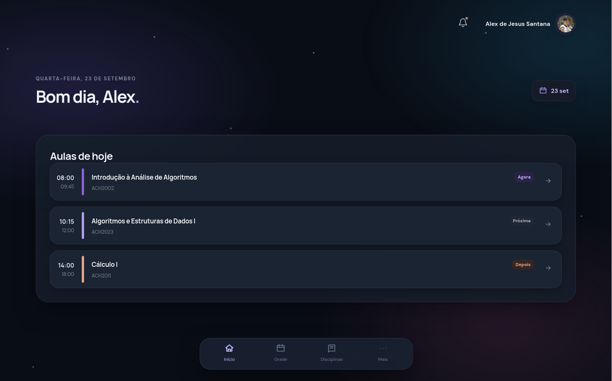

# Dasiboard 🚀



O **Dasiboard** é uma aplicação web full-stack desenvolvida para facilitar a visualização e o gerenciamento de dados e horários acadêmicos. Com uma arquitetura moderna, o projeto oferece um painel interativo (dashboard) com autenticação segura e integração automatizada para extração e organização de grades horárias (incluindo suporte integrado para sistemas como o Júpiter).

## 🛠 Tecnologias Utilizadas

Este projeto foi construído utilizando as seguintes tecnologias:

### Frontend
*   **[React](https://reactjs.org/)**: Biblioteca JavaScript para construção da interface de usuário.
*   **[TypeScript](https://www.typescriptlang.org/)**: Superset do JavaScript que adiciona tipagem estática.
*   **[Vite](https://vitejs.dev/)**: Bundler ultrarrápido utilizado para o ambiente de desenvolvimento e build de produção.

### Backend & API
*   **Vercel Serverless Functions**: A pasta `/api` concentra as rotas do backend (`/api/auth`, `/api/schedule`), rodando de forma serverless na Vercel.
*   **Autenticação**: Integração com Google OAuth (`api/auth/google.ts`).
*   **Node.js / TypeScript**: Lógica de servidor, extração e tratamento de dados.

### Banco de Dados
*   **[Supabase](https://supabase.com/)**: Plataforma open-source baseada em PostgreSQL utilizada para armazenamento de dados e gerenciamento de esquemas (configurado via `supabase/schema.sql`).

### Ferramentas de Qualidade
*   **[Oxlint](https://oxc-project.github.io/docs/guide/usage/linter.html)**: Linter rápido escrito em Rust para manter a qualidade e padronização do código (`.oxlintrc.json`).

## 📁 Estrutura do Projeto

A estrutura de diretórios foi pensada para separar claramente o frontend do backend:

```text
dasiboard-omg-main/
├── api/                  # Vercel Serverless Functions (Rotas da API)
│   ├── auth/             # Rotas de autenticação (Google, Logout, Me)
│   └── schedule/         # Rotas de grade horária (ex: jupiter.ts)
├── public/               # Assets públicos estáticos (ícones, favicons)
├── server/               # Lógica interna do servidor e conexão com DB
├── src/                  # Código fonte do Frontend (React)
│   ├── assets/           # Imagens e SVGs utilizados na interface
│   ├── App.tsx           # Componente raiz da aplicação
│   └── main.tsx          # Ponto de entrada do React
├── supabase/             # Configurações e Migrations do banco de dados
│   └── schema.sql        # Estrutura de tabelas do PostgreSQL
├── .oxlintrc.json        # Configuração do linter Oxlint
├── vercel.json           # Configurações de deploy na Vercel
├── vite.config.ts        # Configurações do Vite
└── package.json          # Dependências e scripts do projeto
```

## ✨ Principais Funcionalidades

*   **Autenticação Google**: Login seguro e simplificado utilizando contas do Google.
*   **Integração de Horários (Jupiter)**: Sistema para buscar, processar e exibir rotinas e grades horárias automaticamente.
*   **Dashboard Interativo**: Interface responsiva e em tempo real servida pelo React.
*   **Sessões Persistentes**: Gerenciamento de estado de usuário integrado com o backend Supabase.

## 📜 Licença

